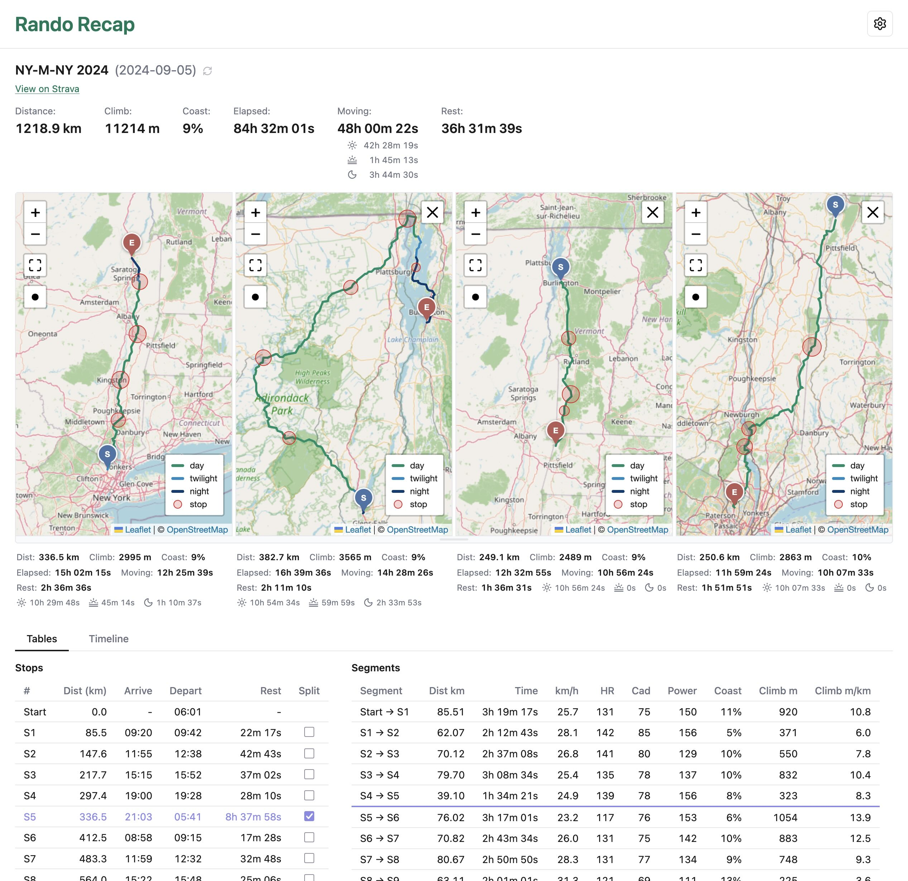

# Rando Recap

Per-stop and per-segment analysis of randonneuring rides, from Strava
activity streams. Stops are auto-detected from gaps in the recording (your
Garmin pauses at stops, leaving gaps in the time stream).

Runs as a local web app: a FastAPI server with a Leaflet-based single-page UI
that renders a map, timeline, and per-stop / per-segment tables, with
linked hover across all three. The same analysis is also available from the
CLI.



## Setup

1. Create a Strava API application: <https://www.strava.com/settings/api>
   Set "Authorization Callback Domain" to `localhost`.
2. Copy `.env.example` to `.env` and fill in `STRAVA_CLIENT_ID` and
   `STRAVA_CLIENT_SECRET`.
3. Install deps and start the server:

   ```bash
   uv sync
   uv run app serve
   ```

   Open <http://localhost:8000> and click **Sign in with Strava**; approve
   access. Use the `localhost` host (not `127.0.0.1`) so the OAuth callback
   matches the "Authorization Callback Domain" you registered above. The token
   is stored under your OS config dir
   (`~/Library/Application Support/rando-recap/token.json` on macOS) and
   refreshed automatically — sign-in is a one-time step that survives restarts.

## Web app

```bash
uv run app serve                       # http://localhost:8000
uv run app serve --host 0.0.0.0 --port 8080
uv run app serve --reload              # dev: auto-reload on code change
```

Routes:

- `/` — ride list (filtered by minimum distance). Click a ride for the
  analysis view: map, timeline, stops table, segments table.
- `/api/rides` — JSON list of cached rides. Query: `min_distance_km`, `types`.
- `/api/rides/{activity_id}/analysis` — JSON analysis. Query: `min_stop`,
  `refresh`.

The analysis view shows a route polyline colored by day/night (using sunrise
/ sunset for the ride's location and date), stop markers, and a segment
timeline. Hovering any peer (table row, timeline bar, map element)
highlights the others.

UI state lives in the URL hash: `#min_dist=190` on the list, and
`#ride=<id>&min_stop=5m` on the analysis page — refresh-safe and shareable.

The server is single-user with no auth; bind to `127.0.0.1` unless you know
what you're doing. Populate the local cache with `uv run app fetch` first
(see below).

## CLI

```bash
uv run app analyze <activity_id>
uv run app analyze <activity_id> --min-stop 10m   # raise stop threshold
uv run app analyze <activity_id> --json           # structured output
uv run app analyze <activity_id> --refresh        # bypass local cache
```

`<activity_id>` is the integer at the end of a Strava activity URL.

The terminal report shows:

- **Stops** — clock time arriving / departing / dwell, with lat,lng.
- **Segments** — distance, time, avg km/h, avg HR, avg cadence, avg power,
  climb (m), climb m/km. Within a segment elapsed time = moving time, since
  paused intervals only appear at stops.

### Bulk-cache rides

`app fetch` walks your Strava history and stashes each activity's summary
metadata locally. Only the listing endpoint is hit (~1 call per 200
activities, no per-ride detail call) — the summary already carries every
field `analyze` needs. Streams are still fetched on demand by `analyze`.

```bash
uv run app fetch                          # last month
uv run app fetch --since all              # first-time full sync
uv run app fetch --since 6m
```

`--since` accepts `Nd` / `Nw` / `Nm` / `Ny` (days/weeks/months/years), `all`,
or a `YYYY-MM-DD` date. The command is idempotent — already-cached rides are
skipped — and respects Strava's rate limits (sleeps near the 100-req /
15-minute cap, retries once on 429, aborts on daily-limit exhaustion).

Filtering by sport type and minimum distance happens at list / serve time,
not at fetch time, so you can change the threshold without re-fetching.

To see which rides are in the cache (and grab an id for `analyze`):

```bash
uv run app list                                   # ≥190 km, Ride/GravelRide
uv run app list --min-distance 200 --types Ride
```

## Caching

API responses are cached at `~/Library/Caches/rando-recap/cache.db`
(macOS) so re-runs and threshold tweaks don't re-hit Strava. Pass
`--refresh` (CLI) or `?refresh=true` (HTTP API) to force a fetch.

## Development

Python (ruff + pyrefly + pytest) and JS (oxlint + oxfmt over the static
frontend) share one Makefile:

```bash
make format      # ruff + oxfmt
make lint        # ruff + oxlint
make typecheck   # pyrefly
uv run pytest
```

Requires Python ≥ 3.14. Frontend tooling installs via `npm install`
(devDependencies only — there's no JS build step; `static/` is served
as-is, and Leaflet is loaded from a CDN).

## License

Source code is licensed under the MIT License (see [LICENSE](LICENSE)).

The MIT license does **not** apply to third-party trademarks or brand assets.
The Strava name, logos, and the "Powered by Strava" / "Connect with Strava"
marks (e.g. files under `src/rando_recap/static/vendor/strava/`) are trademarks
of Strava, Inc. They are included only for the attribution required by the
[Strava API Agreement](https://www.strava.com/legal/api) and are governed by
the Strava Brand Guidelines, not by this project's license.
